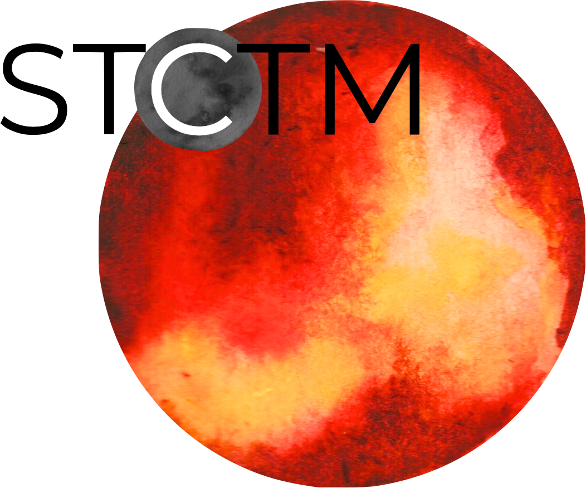

# Welcome to *stctm*!
*stctm* (STellar ConTamination Modeling) performs spectral retrievals on **exoplanet transmission spectra** and (out of transit) **stellar spectra** assuming they can be explained by a combination of stellar surface spectral components.

If you use this code, please cite the associated Zenodo repository (until the JOSS paper submission), with the following DOI: 10.5281/zenodo.13153251 (see [Citation](#citation) section below).

If you use it, please make sure to also cite MSG (https://doi.org/10.21105/joss.04) and the source of the stellar models grid you use. First public release associated to: Piaulet-Ghorayeb et al., 2024 (https://ui.adsabs.harvard.edu/abs/2024ApJ...974L..10P/abstract).

Previous uses of the code:
- Lim et al., 2023 ([TRAPPIST-1 b](https://ui.adsabs.harvard.edu/abs/2023ApJ...955L..22L/abstract))
- Roy et al., 2023 ([GJ 9827 d](https://ui.adsabs.harvard.edu/abs/2023ApJ...954L..52R/abstract))
- Piaulet-Ghorayeb et al., 2024 ([GJ 9827 d](https://ui.adsabs.harvard.edu/abs/2024ApJ...974L..10P/abstract))
- Radica et al., 2025 ([TRAPPIST-1 c](https://ui.adsabs.harvard.edu/abs/2025ApJ...979L...5R/abstract))

Bare-bones skeleton of the code released for now - full user instructions and user-friendly setup to come soon!

Example application: Visit 1 of TRAPPIST-1 b (Lim et al., 2023), fitting for spots and faculae with varying log g relative to the star.

## Table of Contents

- [Installation](#installation)
- [Dependencies](#dependencies)
- [Stellar Models](#stellar-models)
- [Stellar Contamination Retrieval vs. Stellar Spectrum Retrievals](#stellar-contamination-retrieval-vs-stellar-spectrum-retrievals)
- [Stellar Contamination (TLSE) Retrievals](#stellar-contamination-tlse-retrievals-with-stctm)
  - [Run Instructions](#setting-up-a-retrieval-run-instructions)
  - [Modifying the ini File](#setting-up-a-retrieval-modifying-the-ini-file)
  - [Post-processing](#post-processing)
- [*exotune*: Retrievals on Stellar Spectra](#exotune-retrievals-on-stellar-spectra)
  - [Run Instructions](#running-an-exotune-retrieval)
  - [Post-processing](#post-processing-1)
- [Citation](#citation)


  
## Installation

You can install *stctm* from GitHub:

    git clone https://github.com/cpiaulet/stctm.git
    cd stctm
    pip install -e .
    
### Dependencies
The dependencies of *stctm* are *NumPy*, *scipy*, *emcee*, *corner*, *astropy*, *h5py*, *matplotlib*, *pandas*, *tqdm* (for progress bar with MCMC retrievals).

#### Stellar models

You may also need 
* *pysynphot* (if you want to use their version of the stellar models interpolator), and/or
* *pymsg* (my personal favorite - needed to run ```create_fixedR_grid_pymsg_template.py```)

To install *pymsg*, you can find instructions at https://msg.readthedocs.io/en/stable/ and then download the grid(s) of your choice from http://user.astro.wisc.edu/~townsend/static.php?ref=msg-grids.

#### Create your own grid of stellar models using MSG

If you choose to use the *MSG* module for stellar models, the code requires a pre-computed grid of stellar models for the planet of interest.
I provide a template code snippet for how to go about computing this stellar models grid in ```create_fixedR_grid_pymsg_template.py```. Here are a few things to pay attention to.

1. Make sure that your paths are set up properly.
Specifically, you need to have the ```MESASDK_ROOT``` and ```MSG_DIR``` environment variables defined.
You can do this via the command-line:

    $ export MESASDK_ROOT=~/mesasdk
   
or in the code itself:

    import os
    os.environ['MESASDK_ROOT'] = "/home/caroline/mesasdk"

3. Choose your stellar parameters.
You will need to edit the star effective temperature, Fe/H, and log g. The cleanest way to do this is to add another code block corresponding to the name of your star

4. Choose the stellar grid you already downloaded.
In my case, I downloaded the ```'sg-Goettingen-HiRes.h5'```, but you can edit this to match the grid of your choice from the sample available at http://user.astro.wisc.edu/~townsend/static.php?ref=msg-grids.

5. Edit the grid model parameters to match your needs
The template I provide sets a range of log g values (```logg_range```), stellar effective temperature values (```Teff_range```), and a grid spacing (defined by ```loggstep``` and ```Teffstep```) that matches the default settings of the main code. You can however change these depending on your needs for the specific star-planet case. If you edit these, make sure to pay attention to the section "Setting up the stellar parameters and reading in the grid of stellar models" in the retrieval run instructions!

I also compute the grid at a resolving power of 10,000 (```resPower_target```), and over a wavelength range from 0.2 to 5.4 microns (```wv_min_um``` and ```wv_max_um```), which you can also change to fit your needs.

To calculate a grid of models, navigate to the folder where the run script resides, and simply run:
    python create_fixedR_grid_pymsg_template.py

## Stellar contamination retrieval vs. stellar spectrum retrievals

Copy the contents of ```stctm/example/``` wherever in your installation you want to run the code.

With ```stctm```, you can either fit **transmission spectra** to obtain constraints on the TLSE (assuming it can explain all of the spectral variations), or fit **stellar spectra** to infer the mixtures of spectral components that can reproduce an observed flux-calibrated stellar spectrum (```exotune``` sub-module).

* The basic setup of ```stctm``` allows you to obtain posterior distributions on stellar surface parameters and ranges of transmission spectra that best match an observed transmission spectrum from the effect of unocculted stellar surface heterogeneities **alone** (TLS retrieval). To run such a retrieval, use the examples in ```stellar_contamination_analysis/``` (results to be populated in a ```stellar_contamination_results/``` folder).
* For stellar spectrum retrievals with ```exotune```, use the examples in ```exotune_analysis/``` (results to be populated in a ```exotune_results/``` folder).

## Stellar contamination (TLSE) retrievals with *stctm*

You can fit any transmission spectrum (loaded into the code as a ```TransSpec``` object) assuming any variations from a straight line are due to the transit light source effect. In its current configuration, you can fit the contributions of spots and/or faculae, varying or fixing the temperatures of the heterogeneity components, as well as fit the surface gravity used for the photosphere and/or heterogeneity models. The code has the flexibility to handle Gaussian priors on any fitted parameter as well as linear or log-uniform priors on the heterogeneity covering fractions. You obtain a range of outputs including posterior samples (parameters, spectra), run statistics for model comparison, and publication-ready plots.

### Setting up a retrieval: Run instructions

All the inputs you need to provide are specified in a ```.ini``` file, in a way similar to what I implemented for *smint* (github.com.cpiaulet/smint). 

You should follow the following folder structure, starting with a copy of the ```stctm/example/``` directory anywhere in your installation you may want to run the code.
* ```stellar_contamination_analysis/any_analysis_folder_name/```: my advice is to create a new analysis folder name under the ```stellar_contamination_analysis``` folder for each project you work on. In the example, that folder is called ```template_analysis/```.
* In that folder, you'll need an analysis script (unless you need to customize things, you should just use a copy of ```stellar_retrieval_v14_generic_runfile.py```, and a ```.ini``` file, where you specify all the inputs following the instructions in the comments (see more information below).
* At the same level as ```stellar_contamination_analysis/```, create a folder called ```stellar_contamination_results/```. For each of your runs, a subfolder will be added under this results directory and the run results will be saved there.

Here is an example one-liner to run a *stctm* retrieval from a planet spectrum, after navigating to ```stellar_contamination_analysis/template_analysis```:

    python stellar_retrieval_v14_generic_runfile.py template_ini_stctm.ini

A few additional tips:
* The "ini file" (.ini) contains all the user input necessary to run the code, including stellar and mcmc parameters, saving paths and plotting options
* The path to an "ini file" needs to be provided to the python (.py) script (if different from the default) *or* provided as an argument if the script is run from the command line
* Any parameter in the ini file can be modified from the default using the command line (instead of modifying the file). For instance, if you want to run the same fit as above, but only modify the suffix used for creating the output directory, you can do it as follows:
```
    python stellar_retrieval_v14_generic_runfile.py template_ini_stctm.ini -res_suffix=second_test
```

* Make sure that your environment paths are set up properly. Specifically, you need to have the ```CRDS_SERVER_URL```, ```CRDS_PATH```, and ```PYSYN_CDBS``` environment variables defined.
You can do this via the command-line (see example below for ```CRDS_PATH```):
```
    export CRDS_PATH=/home/caroline/crds_cache
```  
or in the code of the analysis file itself:
```
    import os
    os.environ['CRDS_PATH'] = "/home/caroline/crds_cache"
```

### Setting up a retrieval: Modifying the ini file

#### Setting up labels and path to spectrum file
Under ```[paths and labels]`` you can set up:
* ```path_to_spec``` (path to your spectrum file) as well as ```spec_format``` (your spectrum is read in from your data file as a ```TransSpec``` object using the ```spec_format``` setting you choose - if you are not sure which option to choose, or need to add another option to read in your specific format, you can do so in ```pytransspec.py```!)
* ```res_suffix```: a suffix used for all the files that will be saved as a result of this run, in the results folder. This is the identifier you can use to record information on the spectrum, the setup of the fit, etc: make sure it is unique to avoid overwriting the contents of your results folder!
* ```stmodfile```: the path to your stellar models grid file, in the HDF5 format
* ```save_fit```: ```True``` to save files to the results directory during the post-processing steps.

#### Setting up the stellar parameters

Under ```[stellar params]```, enter the parameters of the star to set the defaults for the fit. 

Default values for the stellar and heterogeneity log g:

* ```logg_phot_source```: ```value``` to use the value of ```logg_phot_value``` as the stellar photosphere log g, otherwise ```loggstar``` to use the value provided in the code block below containing the stellar parameters;
* ```logg_het_default_source```: ```value``` to use the value of ```logg_het_value``` as the heterogeneities (default, if fitted) log g, otherwise ```logg_phot``` to set it to the same value as the stellar photosphere log g.

#### Reading in the grid of stellar models

Under ```[stellar models]```, modify the range and spacing of the grid in the log g and Teff dimensions to match those of the grid you generated. You also need to match the resolving power, and wavelength edges you picked when setting up the grid.

#### Choosing the setup of your retrieval

Under ```[MCMC params]``` you can choose:
* ```nsteps```: the number of steps for each of the MCMC chains. I recommend at least 5000, but I chose 3000 to make the test run a bit quicker :)
* ```frac_burnin```: the fraction of steps discarded as burn-in to obtain the posterior. By default, set to 60% (value of 0.6).
* ```fitspot```: ```True``` if you want to fit for the fraction of unocculted spots, ```False``` otherwise.
* ```fitfac```: ```True``` if you want to fit for the fraction of unocculted faculae, ```False``` otherwise.
* ```fitThet```: ```True``` if you want to fit for the temperature of unocculted spots and/or faculae, ```False``` otherwise.
* ```fitTphot```: ```True``` if you want to fit for the temperature of the photosphere, ```False``` otherwise.
* ```fitlogg_phot```: ```True``` if you want to fit the photosphere log g, ```False``` otherwise.
* ```fitlogg_het```: ```True``` if you want to fit a different log g for the spectrum of the heterogeneity component compared to that of the photosphere, ```False``` otherwise.
* ```fitDscale```: ```True``` if you want to fit for the bare-rock transit depth (recommended), ```False``` otherwise.

#### Priors

Under ```[priors]```, you can set a Gaussian prior on any of your fitted parameters, using the ```gaussparanames``` and ```hyperp_gausspriors``` variables.

By default (uniform priors on all fitted parameters):
```
gaussparanames =
hyperp_gausspriors =
```
Otherwise, you can add the name of the parameter(s) for which you want to use a Gaussian prior to ```gaussparanames```, and add a component to ```hyperp_gausspriors``` that specifies the mean and standard deviation of the gaussian parameter to adopt (looks like ```mean_std```). Here's an example when using a Gaussian prior on the photosphere temperature (recommended, since it is not constrained by the TLSE):
```
gaussparanames = Tphot
hyperp_gausspriors = 2566_70
```

The spot/faculae covering fractions can also be fitted with priors that are uniform in linear space (default) or in log space. This is dictated by the ```fitLogfSpotFac``` parameter. 
* Use ```fitLogfSpotFac = 0_0``` for the default settings of both parameters fitted with linear-uniform priors
* Set the first/second element to 1 instead to use a log-uniform priors on ```fspot```(```ffac```).
* If you choose to fit either parameter in log space, the boundaries of the prior on log(fhet) will be set by ```hyperp_logpriors = lowerBound_upperBound```.

If you wish to change the way the prior is set up on any of the fitted parameters, you can do it by changing the dictionary created by the function ```get_param_priors()``` in ```stellar_retrieval_utilities.py```.

#### Plotting

I am providing some flexibility on how your output plots will look under ```[plotting]```, with the ```pad``` parameter (roughly, the padding in microns added to the left and right of the spectrum plots compared to the extent of the observed spectrum), and ```target_resP``` which specifies the resolving power at which you wish your stellar contamination spectra to be plotted.

### Post-processing

By default, the code will produce (and save to the results folder):

Inputs to the code:

* a copy of the run file that was used and of the .ini file with the specified inputs
* a copy of the version of ```stellar_retrieval_utilities.py``` that was used
* a figure displaying the spectrum being fitted
* ```defaultparams```: CSV file with the default parameters used to initialize the fit

Outputs of the code:

CSV files:
* ```pandas``` file: fitted parameters from the chain, with the associated log likelihood and log probability values
* ```bestfit``` file: for each parameter, the best-fit value (maximum likelihood), the max-probability values, as well as percentiles which can be used for quoting in tables
* ```bestfit_stats``` file: model comparison statistics: index of the best-fit model (in the post-burnin samples), the corresponding (reduced) chi-squared value, and BIC
* ```fixedR_1_2_3_sigma``` file: a csv file containing a set of models at the resolving power ```target_resP``` (R=100 by default) corresponding to the max-likelihood, max-probability samples, and percentiles
* ```blobs_1_2_3_sigma``` file: a csv file containing a set of models integrated within the bins of the observed spectrum corresponding to the max-likelihood, max-probability samples, and percentiles

NPY file: contains the "blobs": the series of models computed by the MCMC.

Diagnostics figures:
* ```chainplot```: chain plots, with and without the burn-in steps
* ```bestfit_model``` file: a plot of the best-fit model, integrated to match the bins in the observed spectrum, with the best-fit parameter values quoted

Publication-ready figures:
* ```1_2_3_sigma_withamplitude``` file: same as ```1_2_3_sigma``` but with a lower panel showing the amplitude of the stellar contamination signature across wavelength in the spectrum (in absolute terms)
* ```resP..._1_2_3_sigma``` files: fitted spectrum with the results of the fit (max-likelihood, max-probability samples, and +/- 1, 2, 3 sigma), with stellar models at higher resolution (resolving power ```target_resP```), with a log or lin scale for the wavelength axis.
* ```1_2_3_sigma``` files: fitted spectrum with the results of the fit (max-likelihood, max-probability samples, and +/- 1, 2, 3 sigma), with stellar models all integrated within the same bins as the data, with a log or lin scale for the wavelength axis.
* a corner plot of post-burnin samples

Please let me know if other things would be useful for you to have as default outputs, or feel free to create pull requests with your nice additions!

## *exotune*: Retrievals on stellar spectra

You can fit any stellar spectrum (loaded into the code as a ```pyStellSpec``` object) assuming it can be represented by a linear combination of 1-3 components: the photosphere, cooler regions (spots), and hotter regions (faculae). In the current configuration, you can fit the contributions of spots and/or faculae, varying or fixing the temperatures of the heterogeneity components, as well as fit the surface gravity used for the photosphere and/or heterogeneity models. The code has the flexibility to handle Gaussian priors on any fitted parameter as well as linear or log-uniform priors on the heterogeneity covering fractions. You obtain a range of outputs including posterior samples (parameters, spectra), run statistics for model comparison, and publication-ready plots. *exotune* can also be run in parallel on multiple core, which enables extremely fast inferences on large computing clusters despite the typically larger number of points in a stellar spectrum dataset.

### Setting up a retrieval

In the way it is currently set up, *exotune* retrievals require entering the user inputs directly in the run script (top sections). I am working on a more user-friendly way of doing this using a setup file which should be added to the main branch soon.

#### File and environment paths
The path to which files are saved does not depend on the name of the folder in which the main run file (in the example, ```exotune_runscript_v3_clean_20250409.py```), resides. However, relative paths matter as the results folder will reside in ```../../exotune_results/``` (run-specific results folder automatically created by the code). 

Make sure that your environment paths are set up properly.
Specifically, you need to have the ```CRDS_SERVER_URL```, ```CRDS_PATH```, and ```PYSYN_CDBS``` environment variables defined.
You can do this via the command-line (see example below for ```CRDS_PATH```):

    export CRDS_PATH=/home/caroline/crds_cache
   
or in the code of the analysis file itself:

    import os
    os.environ['CRDS_PATH'] = "/home/caroline/crds_cache"

#### Preprocessing options

Contrary to its TLS counterpart, *exotune* can do a bit more when it comes to preprocessing. Namely, you can choose to either provide as an input:
1. A time series of stellar spectra
2. A unique stellar spectrum

In scenario 1) (starting from a time series of spectra), the user can decide which time intervals to discard when constructing the spectrum.
* The user may want to use the option to discard selected time intervals to omit spectra that were taken during the transit when constructing the out-of-transit spectrum, or spectra that are associated with flare events.
* There is also the possibility to ignore certain wavelength intervals, e.g. if they are affected by saturation or contamination.

The current implementation supports the hdf5 files that are the Stage 3 outputs from Eureka!, but other formats can be implemented as well depending on your needs, by editing the code block under ```# Reading in the observed spectrum``` to obtain the 2D time series of spectra.

In scenario 2), the assumption is that the spectrum is in the units of erg/s/cm$^2$/$\mu$m, and you will need to specify ```spec_format```, which is used by the ```pyStellSpec``` object to know how to read in your file. If the options provided in ```stctm/pystellspec.py``` do not match your needs, feel free to add one with a different name! 


Input spectrum file:

* Use ```label_obs``` to define a new setting in terms of where to look for your input files - whether you start from a time-series of spectra, setting ```start_from_timeseries``` to ```True```, or not. You will need to fill the paths under the first ```if start_from_timeseries:``` statement (line ~53) with the relevant information.
* If you set ```start_from_timeseries=True```, then you can save to a csv file the stellar spectrum that will be created by the preprocessing steps. Just set ```save_median_spectrum=True```, and specify the path to the file where the spectrum should be saved as ```path_save_median_spectrum```.

Selecting preprocessing choices (only actually matters if you selected ```start_from_timeseries=True```):

You will need to specify an ```obsmaskpattern```, which is essentially a label for a set of preprocessing choices (set under the corresponding ```if obsmaskpattern == "XXX"``` statement). These include:
* ```kern_size```: if set to ```None```, ignored. Otherwise, size of the median-filtering kernel applied prior to plotting of the median-normalized light curve (in order to help with identifying the transit start/end times for instance).
* ```jd_range_mask```: leave as an empty list to use all spectra, or alternatively set to a list of arrays (or lists), each containing the ```[start_time, end_time]``` of the time window to discard prior to constructing the spectrum.
* ```wave_range_mask```: same thing, for the wavelength axis.

#### Setting up the stellar parameters

Under ```User inputs: Stellar parameters```, enter the parameters of the star to set the defaults for the fit. Make sure that you have an option ("if" statement) matching the ```which_star``` setting you entered above.

#### Reading in the grid of stellar models

Under ```User inputs: Read in stellar models grid```, modify the range and spacing of the grid in the log g and Teff dimensions to match those of the grid you generated. You also need to match the resolving power, and wavelength edges you picked when setting up the grid, and make sure you are pointing to the right file path.

#### Choosing the setup of your retrieval

Contrary to the TLS retrieval, with *exotune* you have the option to *only* do the pre-processing. That can be interesting for instance if you'd just like to take a look at the median-filtered light curve to identify which integrations to ignore, before settling on your final setup for the fit. In any case, if you set ```optimize_param``` to ```True```, the plots will be created but the code will stop short of running the retrieval.

Under ```User inputs: MCMC fitting params``` you can choose:
* ```parallel```: if set to ```True```, then the MCMC will be run in parallel on a number of CPUs specified by the ```ncpu``` parameter right below (by default, 30)
* ```nsteps```: the number of steps for each of the MCMC chains. I recommend at least 5000, but I chose 3000 to make the test run a bit quicker :)
* ```frac_burnin```: the fraction of steps discarded as burn-in to obtain the posterior. By default, set to 60% (value of 0.6).
* ```fitspot```: ```True``` if you want to fit for the fraction of unocculted spots, ```False``` otherwise.
* ```fitfac```: ```True``` if you want to fit for the fraction of unocculted faculae, ```False``` otherwise.
* ```fitThet```: ```True``` if you want to fit for the temperature of unocculted spots and/or faculae, ```False``` otherwise.
* ```fitTphot```: ```True``` if you want to fit for the temperature of the photosphere, ```False``` otherwise.
* ```fitlogg_phot```: ```True``` if you want to fit the photosphere log g, ```False``` otherwise.
* ```fitdlogg_het```: ```True``` if you want to fit a different log g for the spectrum of the heterogeneity component compared to that of the photosphere, ```False``` otherwise.

The following parameters aim at accounting for the fact that the models need to be scaled to match your spectrum, as well as the imperfection of stellar models which often lead to large chi-squared differences between model and data.
* ```fitFscale```: ```True``` if you want to fit a scaling factor to the model flux (recommended), ```False``` otherwise.
* ```fiterrInfl```: ```True``` if you want to fit an error inflation factor to the provided data error bars (recommended), ```False``` otherwise.
* ```save_fit```: ```True``` to save files to the results directory during the post-processing steps.

#### Priors and default values

You can set a Gaussian prior on any of your fitted parameters, using the ```gaussparanames``` and ```hyperp_gausspriors``` variables.

By default (uniform priors on all fitted parameters):
```
gaussparanames = np.array([])
hyperp_gausspriors = []
```
Otherwise, you can add the name of the parameter(s) for which you want to use a Gaussian prior to ```gaussparanames```, and add an element to the list ```hyperp_gausspriors``` that consists of a 2-element list of ```[mean_gaussian_prior, std_gaussian_prior]```. Here's an example when using a Gaussian prior on the photosphere temperature (recommended, since it is not constrained by the TLSE):
```
gaussparanames = np.array(["Tphot"])
hyperp_gausspriors = [[Teffstar,70]] # mean and std of the Gaussian prior on Tphot
```
where here I used ```Teffstar``` instead of a value for the stellar effective temperature, as it was defined in the Stellar Parameters section above.

The spot/faculae covering fractions can also be fitted with priors that are uniform in linear space (default) or in log space. This is dictated by the ```fitLogfSpotFac``` parameter. 
* Use ```fitLogfSpotFac = [0,0]``` for the default settings of both parameters fitted with linear-uniform priors
* Set the first/second element to 1 instead to use a log-uniform priors on ```fspot```(```ffac```).
* If you choose to fit either parameter in log space, the boundaries of the prior on log(fhet) will be set by ```hyperp_logpriors = [lower_bound, upper_bound]```.

If you wish to change the way the prior is set up on any of the fitted parameters, you can do it by changing the dictionary created by the function ```get_param_priors()``` in ```exotune_utilities.py```.

* ```logg_phot_source```: ```value``` to use the value of ```logg_phot_value``` as the stellar photosphere log g by default, otherwise ```loggstar``` to use the value provided in the code block below containing the stellar parameters;

* ```res_suffix```: a suffix used for all the files that will be saved as a result of this run, in the results folder. This is the identifier you can use to record information on the spectrum, the setup of the fit, etc: make sure it is unique to avoid overwriting the contents of your results folder!

### Running an *exotune* retrieval

Once you have set up all the parameters in the run file, navigate to your ```exotune_analysis/``` directory and simply run

    python exotune_runscript_v3_clean_20250409.py

(replacing with the name of your run script).

### Post-processing

By default, the code will produce (and save to the newly-created results folder under ```exotune_results/```):

Inputs to the code:

* a copy of the run file that was used
* a copy of the version of ```exotune_utilities.py``` that was used
* a figure displaying the spectrum being fitted
* ```defaultparams```: CSV file with the default parameters used to initialize the fit

Pre-processing:
* ```select_time```: median-filtered light curve with the time intervals taken out of the time series before computing the median spectrum to be used highlighted as shaded regions.
* ```select_wave```: median spectrum before the wavelength regions are taken out, with any wavelength intervals excluded shown as shaded regions.
* ```get_fscale```: data superimposed with the model used to get the initial guess on ```Fscale```, at full-res and binned to the data resolution.
Outputs of the code:

CSV files:
* ```pandas``` file: fitted parameters from the chain, with the associated log likelihood and log probability values
* ```bestfit``` file: for each parameter, the best-fit value (maximum likelihood), the max-probability values, as well as percentiles which can be used for quoting in tables
* ```bestfit_stats``` file: model comparison statistics: index of the best-fit model (in the post-burnin samples), the corresponding (reduced) chi-squared value, and BIC
* ```fixedR_1_2_3_sigma``` file: a csv file containing a set of models at the resolving power ```target_resP``` (R=100 by default) corresponding to the max-likelihood, max-probability samples, and percentiles
* ```blobs_1_2_3_sigma``` file: a csv file containing a set of models integrated within the bins of the observed spectrum corresponding to the max-likelihood, max-probability samples, and percentiles

NPY file: contains the "blobs": the series of models computed by the MCMC.

Diagnostics figures:
* ```chainplot```: chain plots, with and without the burn-in steps.
* ```bestfit_model``` file: a plot of the best-fit model, integrated to match the bins in the observed spectrum, with the best-fit parameter values quoted.

Publication-ready figures:
* ```resP..._1_2_3_sigma``` files: fitted spectrum with the results of the fit (max-likelihood, max-probability samples, and +/- 1, 2, 3 sigma), with stellar models at higher resolution (resolving power ```target_resP```), with a log or lin scale for the wavelength axis.
* ```combo_resP..._1_2_3_sigma``` files: combo plots. At the top, fitted spectrum with the results of the fit (max-likelihood, max-probability samples, and +/- 1, 2, 3 sigma), with stellar models at higher resolution (resolving power ```target_resP```), with a log or lin scale for the wavelength axis. At the bottom, relevant marginalized posterior distributions on stellar spectrum component parameters.
* ```1_2_3_sigma``` files: fitted spectrum with the results of the fit (max-likelihood, max-probability samples, and +/- 1, 2, 3 sigma), with stellar models all integrated within the same bins as the data, with a log or lin scale for the wavelength axis.
* a corner plot of post-burnin samples

Please let me know if other things would be useful for you to have as default outputs, or feel free to create pull requests with your nice additions!

## Citation

Until the submission of this code for a JOSS publication, the following entry to a bib file can be used to cite this code:

    @misc{piaulet_stctm_2024,
        author       = {Caroline Piaulet-Ghorayeb},
        title        = {{stctm: Stellar contamination retrievals and modeling for small planet transmission spectra}},
        month        = aug,
        year         = 2024,
        doi          = {10.5281/zenodo.13153251},
        version      = {1.0.0},
        publisher    = {Zenodo},
        url          = {https://doi.org/10.5281/zenodo.13153251}
        }

